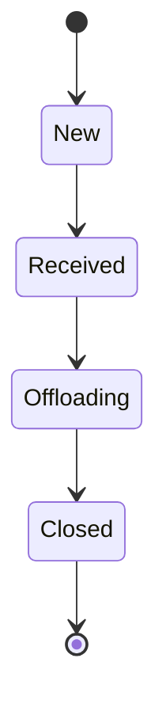
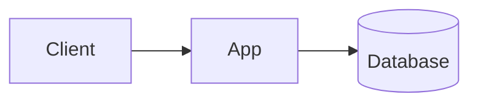
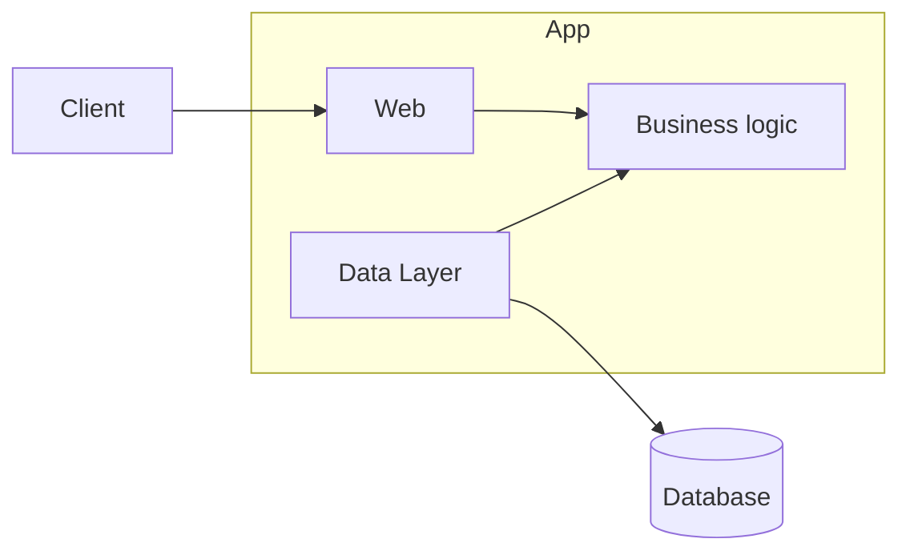

# TorontoJS Agile Demo

A simple live example of a TDD session using XP.

We will be creating a simple application that tracks shipments (i.e. logistics/supply chain).

We will only be concerned about the **Shipment** entity for this example.

## User Stories

### Create a new Shipment

As a **x**
I want to be able to create new shipments
In order to keep track of what products are beling delivered to what store

### Receive a Shipment

As a Store Employee
I want to receive a Shipment
So that I can begin the process of replenishing my stock

## Architecture

We will also be exploring some architecture patterns. A key consideration is that we want to separate our business logic
from our infrastructure. This allows for looser coupling and ensure we don't create a big ball of mud.

Very simple architecture:

Layered Architecture (with reversed dependencies):

