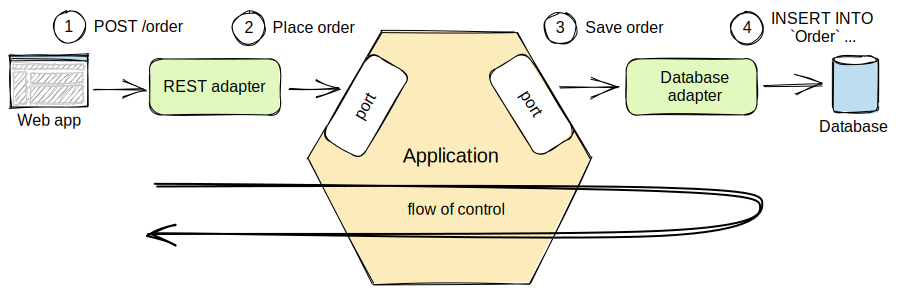
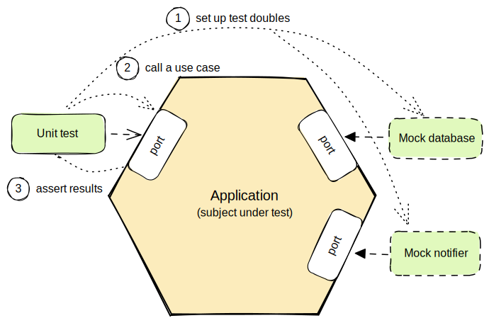
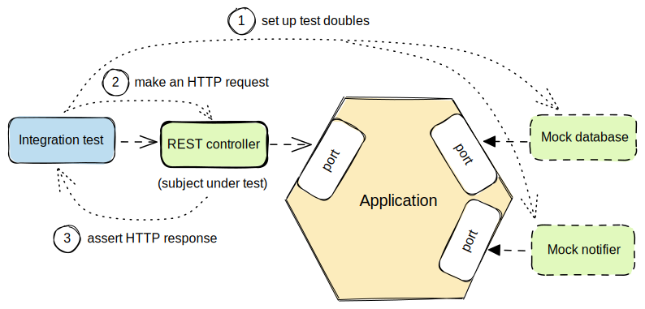

# Architecture

## Simple Layered

## More Complex Layered

## Hexagonal (Ports & Adapters / Clean)

## Hexagonal Flow

## Hexagonal Adapters

A typical mistake is that we write the use cases with knowledge about particular technologies. Such use cases are not speaking business language, become coupled with technologies used and are harder to maintain.

## Testing business Logic (Unit Test)

## Test Primary Adapters

## Test Secondary Adapters

## Testing End to End

