## My Take

1. I like agile. It helps me ship software quicker if done _RIGHT_.

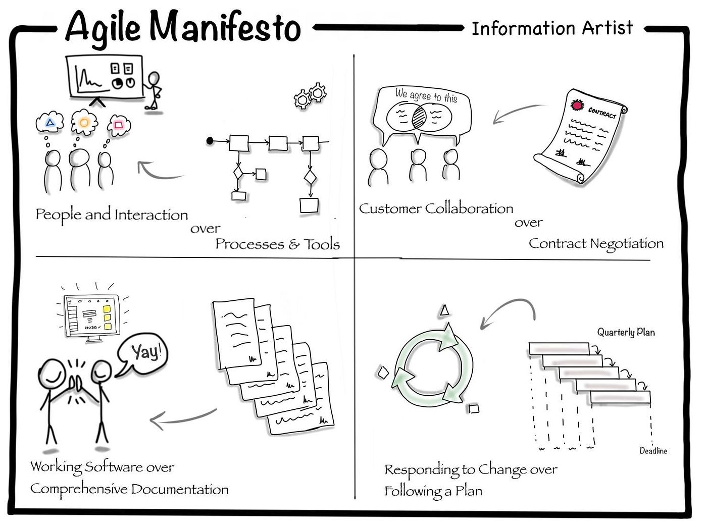

2. Out of all the agile process I like XP the best

3. I practice TDD and BDD

2. There is a difference between Deploy and Released.

### I apply architecture when I need it

Simple
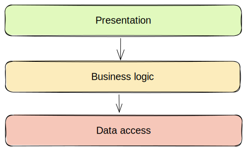

More Complex Layered
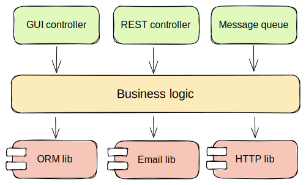

Hexagonal (Ports & Adapters / Clean)

Hexagonal Flow
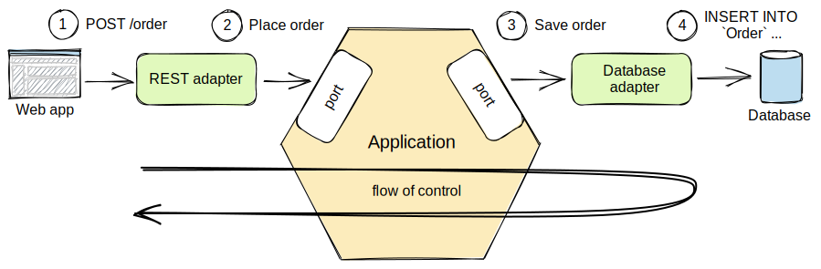

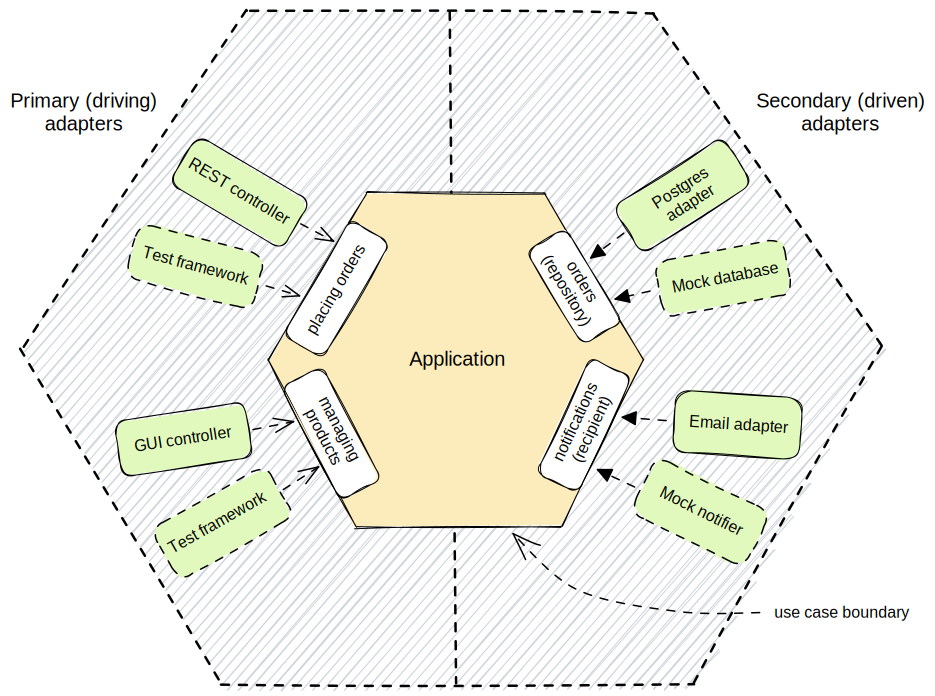

A typical mistake is that we write the use cases with knowledge about particular technologies. Such use cases are not speaking business language, become coupled with technologies used and are harder to maintain.

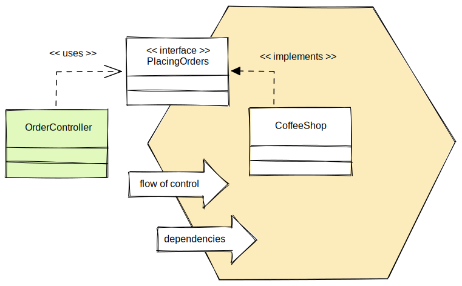

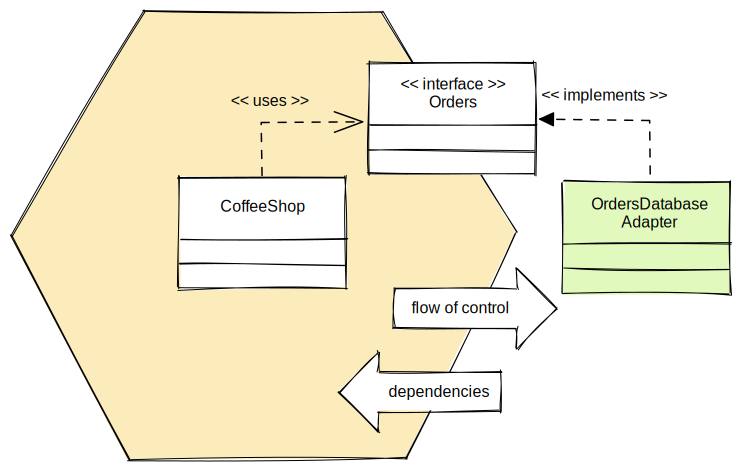

Testing business Logic (Unit Test)
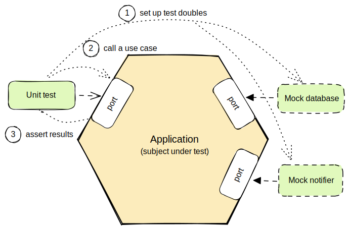

Test Primary Adapters
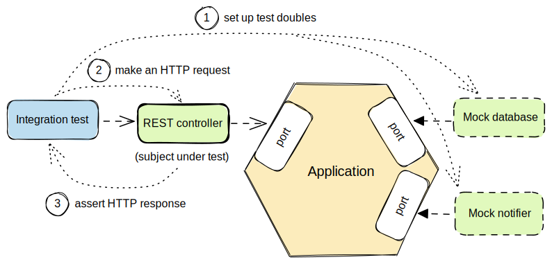

Test Secondary Adapters
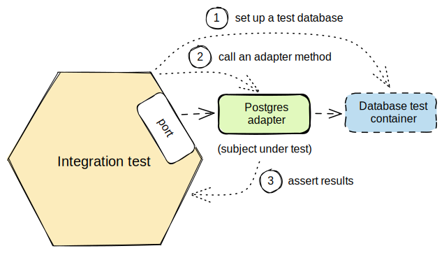

Testing End to End
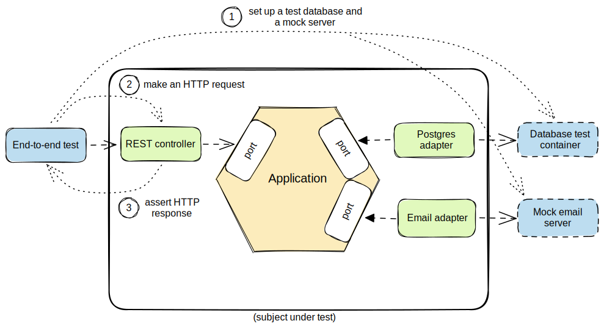

---

## Values of Extreme Programming

### Simplicity

We will do what is needed and asked for, but no more. This will maximize the value created for the investment made to date. We will take small simple steps to our goal and mitigate failures as they happen. We will create something we are proud of and maintain it long term for reasonable costs.

### Communication

Everyone is part of the team and we communicate face to face daily. We will work together on everything from requirements to code. We will create the best solution to our problem that we can together.

### Feedback

We will take every iteration commitment seriously by delivering working software. We demonstrate our software early and often then listen carefully and make any changes needed. We will talk about the project and adapt our process to it, not the other way around.

### Respect

Everyone gives and feels the respect they deserve as a valued team member. Everyone contributes value even if it's simply enthusiasm. Developers respect the expertise of the customers and vice versa. Management respects our right to accept responsibility and receive authority over our own work.

### Courage

We will tell the truth about progress and estimates. We don't document excuses for failure because we plan to succeed. We don't fear anything because no one ever works alone. We will adapt to changes when ever they happen.

---

## Practices

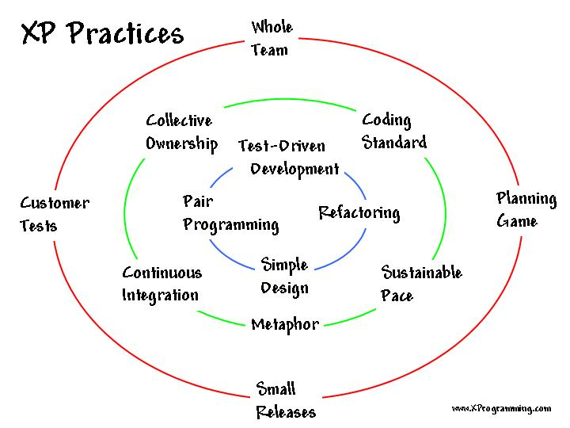

### Sit Together (if possible)

Since communication is one of the five values of XP, and most people agree that face-to-face conversation is the best form of communication, have your team sit together in the same space without barriers to communication, such as cubicle walls.

### Whole Team

A cross-functional group of people with the necessary roles for a product form a single team. This means people with a need as well as all the people who play some part in satisfying that need all work together on a daily basis to accomplish a specific outcome.

### Informative Workspace

Set up your team space to facilitate face-to-face communication, allow people to have some privacy when they need it, and make the work of the team transparent to each other and to interested parties outside the team. Utilize Information Radiators to actively communicate up-to-date information.

### Energized Work

You are most effective at software development and all knowledge work when you are focused and free from distractions.

Energized work means taking steps to make sure you are able physically and mentally to get into a focused state. This means do not overwork yourself (or let others overwork you). It also means staying healthy, and showing respect to your teammates to keep them healthy.

### Pair Programming

Pair Programming means all production software is developed by two people sitting at the same machine. The idea behind this practice is that two brains and four eyes are better than one brain and two eyes. You effectively get a continuous code review and quicker response to nagging problems that may stop one person dead in their tracks.

Teams that have used pair programming have found that it improves quality and does not actually take twice as long because they are able to work through problems quickly and they stay more focused on the task at hand, thereby creating less code to accomplish the same thing.

### Stories

Describe what the product should do in terms meaningful to customers and users. These stories are intended to be short descriptions of things users want to be able to do with the product that can be used for planning and serve as reminders for more detailed conversations when the team gets around to realizing that particular story.

### Weekly Cycle

The Weekly Cycle is synonymous with an iteration. In the case of XP, the team meets on the first day of the week to reflect on progress to date, the customer picks the stories they would like delivered in that week, and the team determines how they will approach those stories. The goal by the end of the week is to have running tested features that realize the selected stories.

The intent behind the time-boxed delivery period is to produce something to show to the customer for feedback.

## Quarterly Cycle

The Quarterly Cycle is synonymous with a release. The purpose is to keep the detailed work of each weekly cycle in the context of the overall project. The customer lays out the overall plan for the team in terms of features desired within a particular quarter, which provides the team with a view of the forest while they are in the trees, and it also helps the customer to work with other stakeholders who may need some idea of when features will be available.

Remember when planning a quarterly cycle the information about any particular story is at a relatively high level, the order of story delivery within a Quarterly Cycle can change and the stories included in the Quarterly Cycle may change. If you are able to revisit the plan on a weekly basis following each weekly cycle, you can keep everyone informed as soon as those changes become apparent to keep surprises to a minimum.

### Slack

The idea behind slack in XP terms is to add some low-priority tasks or stories in your weekly and quarterly cycles that can be dropped if the team gets behind on more important tasks or stories. Put another way, account for the inherent variability in estimates to make sure you leave yourself a good chance of meeting your forecasts.

### Ten-Minute Build

The goal of the Ten-Minute Build is to automatically build the whole system and run all of the tests in ten minutes. The founders of XP suggested a 10-minute time frame because if a team has a build that takes longer than that, it is less likely to be run on a frequent basis, thus introducing a longer time between errors.

This practice encourages your team to automate your build process so that you are more likely to do it on a regular basis and to use that automated build process to run all of your tests.

This practice supports the practice of Continuous Integration and is supported by the practice of Test First Development.

### Continuous Integration

Continuous Integration is a practice where code changes are immediately tested when they are added to a larger code base. The benefit of this practice is you can catch and fix integration issues sooner.

Most teams dread the code integration step because of the inherent discovery of conflicts and issues that result. Most teams take the approach of “If it hurts, avoid it as long as possible”.

Practitioners of XP suggest “if it hurts, do it more often”.

The reasoning behind that approach is that if you experience problems every time you integrate code, and it takes a while to find where the problems are, perhaps you should integrate more often so that if there are problems, they are much easier to find because there are fewer changes incorporated into the build.

This practice requires some extra discipline and is highly dependent on Ten Minute Build and Test First Development.

### Test-First Programming

Instead of following the normal path of:

develop code -> write tests -> run tests

The practice of Test-First Programming follows the path of:

Write failing automated test -> Run failing test -> develop code to make test pass -> run test -> repeat

As with Continuous Integration, Test-First Programming reduces the feedback cycle for developers to identify and resolve issues, thereby decreasing the number of bugs that get introduced into production.

### Incremental Design

The practice of Incremental Design suggests that you do a little bit of work upfront to understand the proper breadth-wise perspective of the system design, and then dive into the details of a particular aspect of that design when you deliver specific features. This approach reduces the cost of changes and allows you to make design decisions when necessary based on the most current information available.

The practice of Refactoring was originally listed among the 12 core but was incorporated into the practice of Incremental Design. Refactoring is an excellent practice to use to keep the design simple, and one of the most recommended uses of refactoring is to remove duplication of processes.

## Some Rules

### Coding

- The customer is always available
- Code the **unit test** first
- Only one pair integrates code at a time
- Leave optimization until last
- No overtime

### Testing

- All code must have unit tests
- All code must pass all unit tets before it can be released
- When a bug is found, tests are created before the bug is addressed (a bug is not an error in logic; it is a test that was not written)
- Acceptance tests are run often and the results published
